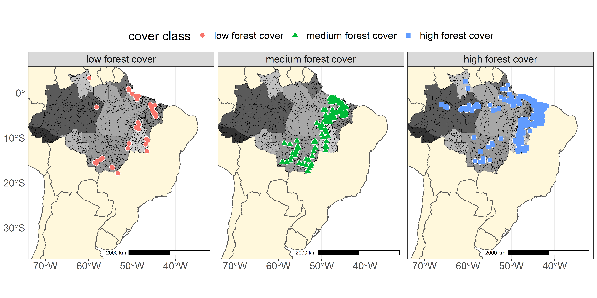

# CuttingDownTrees

 Data and R code to accompany the article:

[NORRIS, D](https://scholar.google.com/citations?user=pi4S-KkAAAAJ&hl=en&oi=ao) *et. al*. Cutting down trees does not build prosperity: On the continued decoupling of Amazon deforestation and economic development in 21st century Brazil. *EarthArXiv* pre-print (not peer reviewed): https://doi.org/10.31223/X51S8P 

<strong>AIM</strong>: Apply the most up to date data to examine spatial and temporal patterns in forest cover changes and economic progress in Brazilian Amazonia.

A (perhaps) timely continuation to the investigations carried out by [Rhett Butler](https://news.mongabay.com/by/rhett-a-butler/) at [Mongabay](https://news.mongabay.com/2021/11/amazon-deforestation-unexpectedly-surges-22-to-highest-level-since-2006/). 

## Abstract

<strong>Background and aims</strong>: 
We present evidence examining spatial and temporal patterns in forest cover changes and economic progress in Brazilian Amazonia. Specifically we tested two predictions embedded in arguments used by influential interest groups: i) where there is less forest cover economic progress should increase and ii) areas with most recent deforestation should have increased economic progress. 

<strong>Methods</strong>: 
Complementary methods assessed variation in economic progress across 794 administrative districts (municipalities) covering 4.9 Mkm2 of the Brazilian Amazon from 2002 to 2019. A representative subset of municipalities was used to compare economic and basic socioeconomic indicators across municipalities with contrasting forest coverage.  

<strong>Results</strong>: 
Contrasting results between the full and a representative subset of municipalities suggests that municipality-level economic progress cannot be directly attributed to loss of natural forests. There was no association between forest loss and economic (average salary) or basic socioeconomic indicators (existence of sanitation plans and internet connectivity). The economic progress of municipalities with less than 40% forest cover in 1986 was no different to that of similar municipalities with more than 60% forest cover from 1986 to 2019. 

<strong>Conclusion</strong>: 
The evidence contradicted both of the predictions tested. Reducing forest cover does not appear to directly promote socioeconomic progress. Any localized associations between forest cover and poverty most likely result from other more plausible alternatives including lack of opportunity and a widespread failure to effectively implement and enforce existing policies within the local socioeconomic context.

<strong>Implications for Conservation</strong>: 
Our findings support evidence from across the tropics that show deforestation does not necessarily generate transformative and equitable food production systems or lead to poverty alleviation. 

## Steps to repeat analysis

..... in progress ........

Files are organized in two folders: [R](https://github.com/darrennorris/CuttingDownTrees/tree/main/R) that has code files and [data](https://github.com/darrennorris/CuttingDownTrees/tree/main/data) that has everything else.

### Step 1 preparation

File <a href="https://github.com/darrennorris/CuttingDownTrees/blob/main/R/prep_mapbiomas.R"><code>prep_mapbiomas.R</code></a> — extracts required subset of municipalities (local government administrative units) from [MapBiomas](https://mapbiomas.org/en/statistics) data and calculates necessary cover and transition values.

File <a href="https://github.com/darrennorris/CuttingDownTrees/blob/main/R/prep_analysis.R"><code>prep_analysis.R</code></a> — selects variables used in modelling, creates new variables (e.g. log transformations) and exports object as R data format ready for modelling.

### Step 2 Models and analysis

Code used to obtain rho values for AR1 correlations and Tweedie index parameter is in file <a href="https://github.com/darrennorris/CuttingDownTrees/blob/main/R/gdp_bams.R"><code>gdp_bams.R</code></a> . File <a href="https://github.com/darrennorris/CuttingDownTrees/blob/main/R/gdp_gams.R"><code>gdp_gams.R</code></a> has additional examples of code used to calculate cross correlations for timeseries, temporal autocorrelation and spatial autocorrelation, plus testing of different GAM model types. 

File <a href="https://github.com/darrennorris/CuttingDownTrees/blob/main/R/run_analysis.R"><code>run_analysis.R</code></a> runs all the analysis and produces figures used in the article. 

File <a href="https://github.com/darrennorris/CuttingDownTrees/blob/main/R/check_analysis.R"><code>check_analysis.R</code></a> runs jackknife randomization used to control effect of sample size.